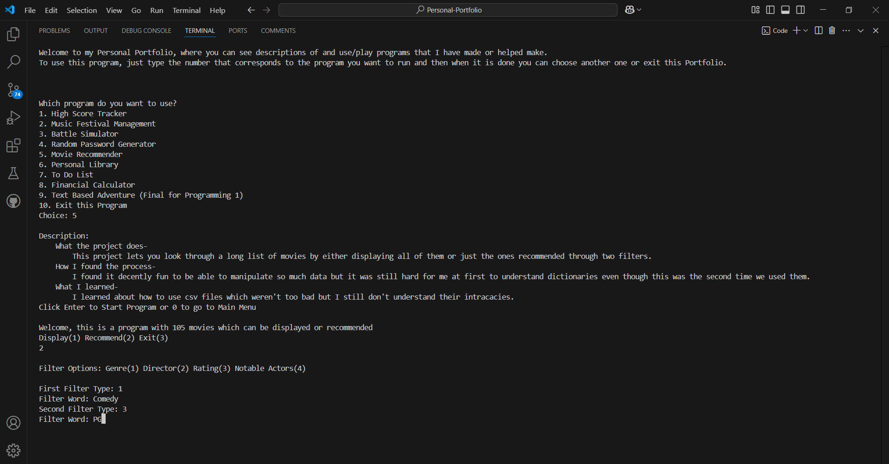

# Personal Portfolio

## Project Description
---
This project's purpose is to display the many different projects I have coded and the skills I have gained from them. This is kinda similar to a resume but for coding projects, becuase it is somewhat of a list of programming acheivements and skills I have accomplished and earned. This project lets you see descriptions of and use/play programs that I have made and helped make.
Paragraph describing the purpose of your project and what it does.  

## Installation
---
Not used for this class  

## Execution and Usage
---
To use this program, just type the number that corresponds to the program you want to run, then you will see a description of it and its creation, where you can decide if you want to run the program or not. If you decide to use the program, you will run it until it is done, and then you can choose another one or exit this Portfolio.

  

## Used Technologies
---
+ Matplotlib
`pip install matplotlib`
+ Numpy
`pip install numpy`
+ Pandas
`pip install pandas`
+ Faker
`pip install Faker`
+ Pygame
`pip install pygame`  

## Current Features
---
+ This project has a lot of decently thorough descriptions for the projects
+ This project lets you run a couple of the group projects we have made
+ This project has nine differnet programs you can run  

## Contributions
---
Not used for this class  

## Contributors
---
+ David (My Brother) - explained how to import the other programs  

## Author's Information
---
The author of this project is Luke Murdock and he is a student at UCAS, currently taking a programming class and creating projects like this one to help him learn python and the basics of programming. He mostly enjoys coding, expecially when it doesn't have many bugs and has a fun end product. He enjoys lots of other things including reading and playing games, including video games. He thinks it would be fun to eventually make some sort of actual game in the future if he ever gets the oppurtunity.  

## Change Log
---
Not used for this class  

## License
---
Not used for this class  