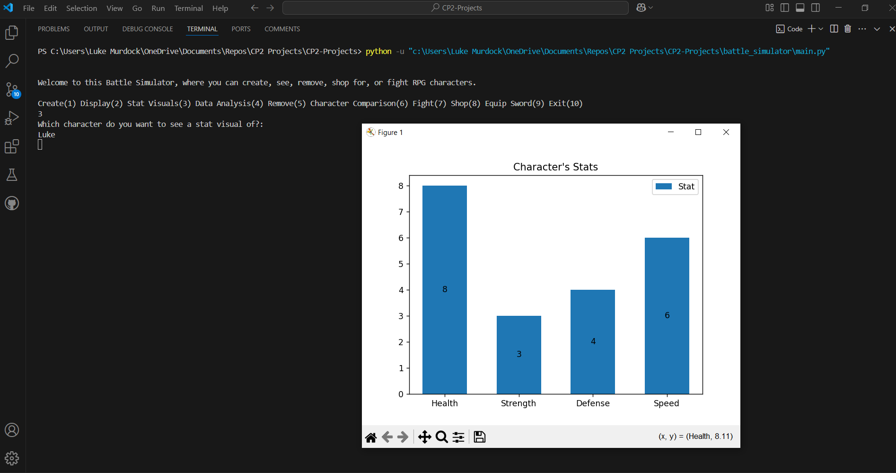

# Updated Battle Simulator

## Project Description
---
This program's purpose is to let the user have fun battling or doing other things as RPG characters they create. The options that the user is given for their characters and the program are create, display, stat visual, data analysis, remove, character comparison, fight, shop, equip, and exit. Each character has a name, class, level, items and stats. When creating and setting this information, you can get a randomly generated character description for inspiration. You can also generate a character. Using the display option lets the user see all of the info for the characters that have been created. The visuals option shows a characters stats in a separate window witha graph. You can also get a data analysis of the character's stats, remove a character, compare stats of the characters, fight and shop as a character, or equip a weapon you get from the shop. Battles are between two of the created characters and is central to the idea of this project.  

## Installation
---
Not used for this class  

## Execution and Usage
---
To use this program you have to install the correct libraries and then run the code. Menus will have you insert numbers that correspond with an action such as Create(1) Remove(2) or Exit(3). The first thing you need to do for the program is create characters and then either fight with them to level up or earn money. Then, you should do other things with your characters like shopping or checking their information. Then you can keep on doing these things as many times as you would like and you could even let other poeple make characters so then you can fight not just your own characters.

  

## Used Technologies
---
+ Matplotlib
`pip install matplotlib`
+ Numpy
`pip install numpy`
+ Pandas
`pip install pandas`
+ Faker
`pip install Faker`  

## Current Features
---
+ This program lets the user pick different classes that each give a character different stat changes and a special ability particular to that class in battle.
+ This program also lets the user get random character ideas to help them start brainstorming.
+ Additionally, this program has actual visuals for some things, including character stats.  

## Contributions
---
Not used for this class  

## Contributors
---
+ Internet and Documentations - Taught how to use the libraries in the ways needed  

## Author's Information
---
The author of this project is Luke Murdock and he is a student at UCAS, currently taking a programming class and creating projects like this one to help him learn python and the basics of programming. He mostly enjoys coding, expecially when it doesn't have many bugs and has a fun end product. He enjoys lots of other things including reading and playing games, including video games. He thinks it would be fun to eventually make some sort of actual game in the future if he ever gets the oppurtunity.  

## Change Log
---
Not used for this class  

## License
---
Not used for this class  
